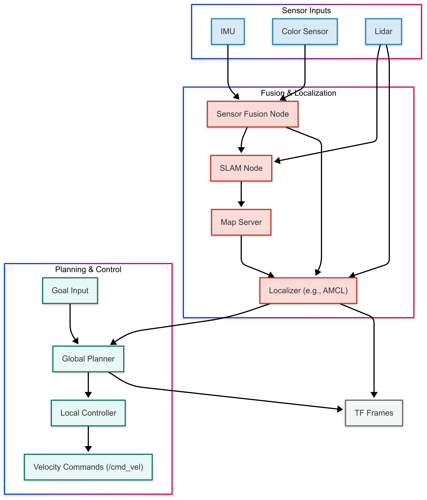
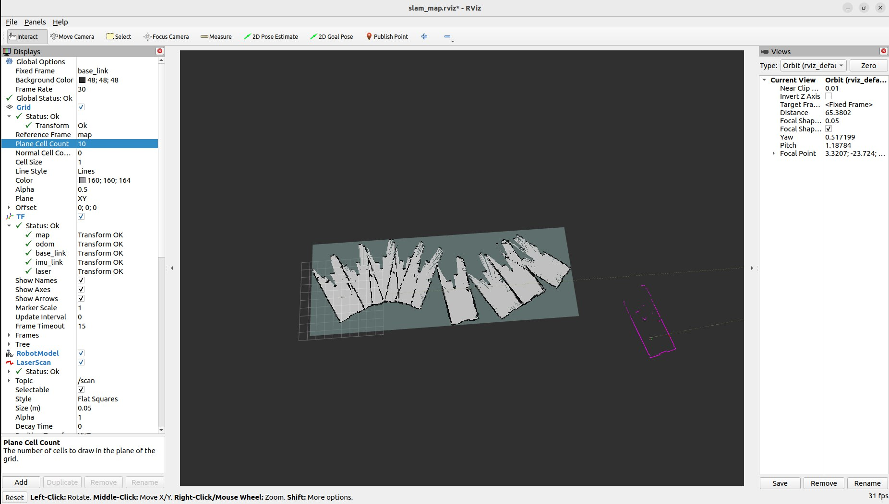
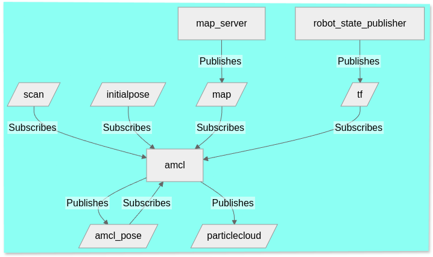
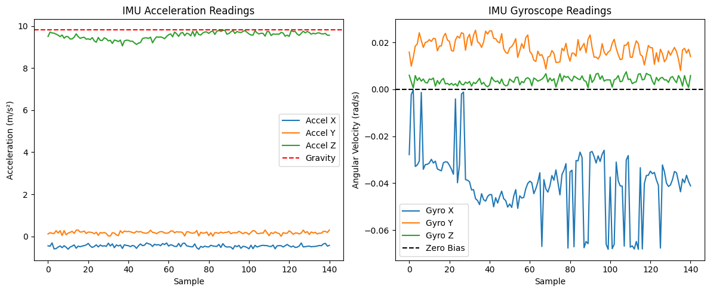
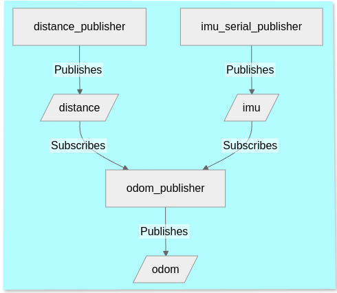

# SEAV ROS 2 Workspace

Software Engineering for Autonomous Vehicles.

---

## To-do
- [ ] Refactor nodes into composable containers for better performance
- [ ] Add diagnostics and real-time status publishers
- [ ] Set up automatic rosbag recording for every launch
- [ ] Create analysis notebooks in `docs/notebooks/`
- [ ] Integrate PlotJuggler or RQT for real-time visualization
- [ ] Add GitHub Actions for `colcon build` and `colcon test`
- [ ] Enforce formatting with `ament_lint`, `black`, `flake8`
- [ ] Create video demos and setup tutorials

---

Awesome! Here's the full **Markdown section** you can **copy-paste directly into your main `README.md`** — ideally after your `📁 Folder Structure` or `📊 TODO` section.

This includes **all your diagrams, screenshots, and the video**, properly formatted and GitHub-compatible.

---

### 🧭 Diagrams, Screenshots, and Media

This section documents all visual aids used to explain system architecture, sensor flows, simulation, and real-world testing of the SEAV robot.

#### 📊 System Design & Architecture

| Preview | Description |
|--------|-------------|
|  | Overview of key Nav2 stack nodes and topic connections. |
|  | Shows how various ROS 2 nodes exchange messages via topics/services. |
|  | Block diagram showing interaction between sensors, localization, control, and planning. |
|  | Visual breakdown of physical, simulation, and planning layers. |
|  | System node graph after launching full stack. |

---

#### 🧭 Localization, SLAM & Sensor Fusion

| Preview | Description |
|--------|-------------|
|  | TF and topic flow diagram of SLAM pipeline in simulation. |
|  | Improved SLAM accuracy after calibrating IMU data. |
|  | SLAM behavior without IMU fusion (visible drift). |
|  | Node-level overview of AMCL-based localization. |
|  | Example of noisy IMU output before calibration. |
|  | How odometry is computed using IMU + distance sensor. |

---

#### ⚙️ Hardware, RViz & RQT

| Preview | Description |
|--------|-------------|
|  | Circuit wiring diagram for Arduino, motor driver, and sensors. |
|  | RViz showing lidar data + URDF model of the real car. |
|  | RQT configured to show topic list and logs in real-time. |

---

#### 🤖 Real Robot Photos & Demos

| Preview | Description |
|--------|-------------|
|  | Physical robot platform used for real-world testing. |
|  | Field test capture from WhatsApp snapshot. |

---

#### 🎥 Video Demonstration

> 🎬 **Real Car Control via `cmd_vel` → Arduino**

[▶️ Watch Video (MP4)](docs/images/real%20car%20drive%20controlling%20thorugh%20cmd_vel%20motor%20controller%20to%20arduino%20serial%20pro.mp4)

*A short clip showing how `cmd_vel` commands from ROS 2 are translated into motor signals sent over serial to an Arduino board.*


---

## 📚 Table of Contents

- [TF Tree](#tf-tree)
- [Package Overview](#package-overview)
- [How to Build](#how-to-build)
- [How to Run Packages](#how-to-run-packages)
- [Folder Structure](#folder-structure)
- [Requirements](#requirements)

---

## 📦 Package Overview

### 1. **seav_test_sensors**
Collects and publishes data from IMU, distance sensor, and odometry.

- **Nodes:** `imu_serial_publisher`, `distance_publisher`, `odom_publisher`
- **Publishes:** `/imu`, `/distance`, `/odom`
- **Subscribes:** `/imu`, `/distance`
- **Dependencies:** `rclpy`, `robot_localization`, `tf2_ros`
- **Launch File:** `ekf.launch.py`
- **Status:** ✅ Built

---

### 2. **rplidar_ros**
Driver package for RPLIDAR A1.

- **Publishes:** `/parameter_events`, `/rosout`
- **Launch File:** `ekf.launch.py`
- **Status:** ✅ Built

---

### 3. **my_nav2_pkg**
Configurations and launch files for ROS 2 Nav2 stack.

- **Nodes:** `robot_state_publisher`, `map_server`, `amcl`, etc.
- **Publishes:** `/tf`, `/map`, `/amcl_pose`, `/cmd_vel`
- **Subscribes:** `/scan`, `/goal_pose`, `/map`
- **Launch Files:** `nav2.launch.py`, `bringup.launch.py`, etc.
- **Status:** ✅ Built

---

### 4. **my_robot_controller**
Forwards velocity commands from `/cmd_vel` to Arduino.

- **Publishes/Subscribes:** `/cmd_vel`, `/rosout`
- **Status:** ✅ Built

---

### 5. **static_tf_publisher**
Publishes static TFs between `base_link`, `imu`, and `lidar`.

- **Node:** `static_transform_publisher`
- **Launch File:** `static_tf_publisher.launch.py`
- **Status:** ✅ Built

---

### 6. **seav_description**
Contains robot URDF/Xacro, meshes, and worlds for Gazebo simulation.

- **URDF:** Modular robot description using `xacro` files
- **Mesh:** `lidar.dae`
- **Launch File:** `bot.launch.py`
- **Worlds:** `empty.world`
- **Status:** ✅ Built

---

### 7. **seav_simulation**
Provides simulation environments and maps for testing and SLAM.

- **Launch Files:**  
  - `autonomous_navigation.launch.py`  
  - `house_sim.launch.py`  
  - `house_slam.launch.py`  
  - `outdoor.launch.py`
- **Maps:** `house_map.pgm`, `house_map.yaml`
- **Worlds:** `house.world`, `bookstore.world`
- **Configs:** `ekf.yaml`, `nav2_params.yaml`
- **Status:** ✅ Built

---

## 🚀 How to Build

From the workspace root (`ros2_ws/`):

```bash
colcon build --symlink-install
source install/setup.bash
source opt/ros/humble/setup.bash
```

---

## ▶️ How to Replicate the workspace 

> This guide walks through bringing up your ROS 2-based robot in **three structured phases**: sensors, actuators, and navigation.

---

### 🔧 Requirements Before You Begin

- Ensure your robot is connected and powered.
- Your `launch` and `run` commands require correct USB port access (e.g., `/dev/ttyUSB0`, `/dev/ttyUSB1`).
- Make sure `install/setup.bash` exists and is sourced.
- All device permissions must be granted (`sudo chmod 666 /dev/ttyUSB*` if needed).

---

## ▶️ PHASE 1: Base + Sensors Only

### 📄 Script: `bringup_phase1.sh`

```bash
#!/bin/bash
SESSION=ros_dev
WORKSPACE="/home/pi/Aditya/demo"

tmux new-session -d -s $SESSION -n rsp "source $WORKSPACE/install/setup.bash && ros2 launch seav_description rsp.launch.py"
tmux new-window -t $SESSION -n rplidar "source $WORKSPACE/install/setup.bash && ros2 launch rplidar_ros rplidar_a1_launch.py"
tmux new-window -t $SESSION -n distance_pub "source $WORKSPACE/install/setup.bash && ros2 run seav_test_sensors distance_publisher"
tmux new-window -t $SESSION -n imu_pub "source $WORKSPACE/install/setup.bash && ros2 run seav_test_sensors imu_serial_publisher"
tmux new-window -t $SESSION -n odom_pub "source $WORKSPACE/install/setup.bash && ros2 run seav_test_sensors odom_publisher"

tmux attach -t $SESSION
```

### ✅ Checkpoints for Phase 1

After launch, check these from another terminal:

```bash
source ~/Aditya/demo/install/setup.bash
ros2 topic list
ros2 run tf2_tools view_frames
ros2 topic echo /scan
ros2 topic echo /imu
ros2 topic echo /odom
```

You can also visualize using:

```bash
ros2 run rviz2 rviz2
```

In RViz:
- Fixed Frame: `base_link` or `base_footprint`
- Add displays: `TF`, `RobotModel`, `LaserScan`, `Odometry`, `IMU`

---

## ▶️ PHASE 2: Add Actuators + SLAM

### 📄 Script: `bringup_phase2.sh`

```bash
#!/bin/bash
SESSION=ros_dev
WORKSPACE="/home/pi/Aditya/demo"

tmux new-session -A -t $SESSION -n motor_ctrl "source $WORKSPACE/install/setup.bash && ros2 run my_robot_controller serial_motor_controller"
tmux new-window -t $SESSION -n slam_toolbox "source $WORKSPACE/install/setup.bash && ros2 run slam_toolbox async_slam_toolbox_node --ros-args --params-file $WORKSPACE/src/seav_slam/mapper_params_online_async.yaml"

tmux attach -t $SESSION
```

### ✅ Checkpoints for Phase 2

- Run `ros2 topic echo /map`
- In RViz:
  - Add `/map`, `/scan`, `/odom`
  - Confirm that map is being built as the robot moves

---

## ▶️ PHASE 3: Localization, Navigation, and EKF

### 📄 Script: `bringup_phase3.sh`

```bash
#!/bin/bash
SESSION=ros_dev
WORKSPACE="/home/pi/Aditya/demo"

tmux new-session -A -t $SESSION -n ekf "source $WORKSPACE/install/setup.bash && ros2 launch my_robot_description ekf_launch.py"
tmux new-window -t $SESSION -n nav2_local "source $WORKSPACE/install/setup.bash && ros2 launch my_nav2_pkg localization_launch.py map:=$WORKSPACE/src/my_nav2_pkg/config/maze_map_save.yaml"
tmux new-window -t $SESSION -n nav2_nav "source $WORKSPACE/install/setup.bash && ros2 launch my_nav2_pkg/navigation_launch.py"

tmux attach -t $SESSION
```

### ✅ Checkpoints for Phase 3

- Confirm `/odom` and `/odom_filtered` are publishing
- Ensure the following Nav2 nodes launch:
  - `/amcl`
  - `/controller_server`
  - `/planner_server`
- In RViz:
  - Add `2D Pose Estimate` and `2D Goal`
  - Send navigation goals and observe robot movement

---

## 🛠️ Run the Bring-Up in Order

```bash
chmod +x bringup_phase1.sh bringup_phase2.sh bringup_phase3.sh

# Phase 1: Sensors + TF
./bringup_phase1.sh

# After validation...
./bringup_phase2.sh

# After SLAM works...
./bringup_phase3.sh
```

---


- Use `Ctrl + B` then `w` in tmux to switch between windows
- Kill session: `Ctrl + B`, then type `:kill-session`

---

## ✅ Summary: What You Gain

| Phase | Purpose |
|-------|---------|
| Phase 1 | Brings up robot model + sensors + TF |
| Phase 2 | Starts actuators and SLAM mapping |
| Phase 3 | Activates EKF, AMCL, and Nav2 goals |

---


## 📁 Folder Structure

```
ros2_ws/
├── src/
│   ├── my_nav2_pkg/
│   ├── my_robot_controller/
│   ├── rplidar_ros/
│   ├── seav_description/
│   ├── seav_simulation/
│   ├── seav_slam/
│   ├── seav_test_sensors/
│   ├── static_tf_publisher/
│   └── scripts/
├── docs/
│   ├── images/  ← TF tree, architecture, circuit diagrams, etc.
│   ├── notebooks/
│   ├── ppt/
│   └── ros2_workspace_documentation.xlsx
├── README.md
├── build/
├── install/
└── log/
```

---
Here's a clean, well-formatted **markdown version** of your `🐞 Troubleshooting & Debugging Tips` section — ready to paste into your `README.md` or any documentation file:

---

## 🐞 Troubleshooting & Debugging Tips

Use this section to quickly diagnose and fix common bring-up issues in each phase, using topics, TFs, RViz, and ROS 2 logs.

---

### 🔧 General Debugging Tips

| Check                      | Command                              |
|---------------------------|--------------------------------------|
| List all topics           | `ros2 topic list`                    |
| Inspect a topic           | `ros2 topic echo /topic_name`        |
| List active nodes         | `ros2 node list`                     |
| View TF frame tree        | `ros2 run tf2_tools view_frames`     |
| Visualize in RViz         | `ros2 run rviz2 rviz2`               |
| View running processes    | `htop` or `top`                      |
| Check connected USB ports | `ls /dev/ttyUSB*`                    |

---

### 🛠️ Phase 1 Issues (Sensors + TF)

| Problem                   | Likely Cause                             | Fix                                                        |
|--------------------------|-------------------------------------------|-------------------------------------------------------------|
| Robot not visible in RViz| `robot_state_publisher` or URDF error     | Check `rsp.launch.py` and verify URDF validity              |
| Wheels not visible       | Missing `joint_state_publisher` or TFs    | Run: `ros2 run joint_state_publisher joint_state_publisher` |
| No TF frames in RViz     | TFs not being published                   | Ensure `robot_state_publisher` is running                   |
| IMU or Lidar not publishing | Serial port or USB not detected        | Run `ls /dev/ttyUSB*` and update the correct port           |
| Permission denied on USB | Insufficient access to `/dev/ttyUSB*`     | Run: `sudo chmod 666 /dev/ttyUSB*`                          |

---

### 🛠️ Phase 2 Issues (Actuators + SLAM)

| Problem             | Likely Cause                               | Fix                                                     |
|--------------------|---------------------------------------------|----------------------------------------------------------|
| No map data `/map` | SLAM node not running or missing input      | Check `async_slam_toolbox_node` logs                     |
| Map not updating    | Wrong RViz frame or missing `/scan`        | Set RViz fixed frame to `map`, confirm laser topic       |
| Robot not moving    | Motor controller misconfigured or not running | Check serial port and controller node output           |

---

### 🛠️ Phase 3 Issues (EKF + Navigation)

| Problem                   | Likely Cause                          | Fix                                                       |
|--------------------------|----------------------------------------|------------------------------------------------------------|
| Navigation goal not executing | AMCL not initialized             | Use `2D Pose Estimate` in RViz                             |
| No path planned          | Map not loaded or pose TFs broken      | Verify `map_server` and `robot_pose` TF tree               |
| Odometry unstable        | EKF config issue or noisy IMU input    | Tune EKF parameters or check `/imu` and `/odom` topics     |
| Nav2 nodes crash         | YAML or parameter error                | Check `localization_launch.py` and `navigation_launch.py`  |

---

### 📄 Debugging Through Logs

ROS 2 nodes automatically save logs. These are critical for understanding crashes, parameter errors, and startup problems.

#### 🔍 Find logs for a node:
```bash
ros2 node info /your_node_name
```

#### 📁 Default log file location:
```bash
~/.ros/log/latest_log/
```

Each node creates a subfolder with its PID. Inside, you'll find:
- `stdout.log` — standard output
- `stderr.log` — error messages

You can inspect them with:

```bash
cat ~/.ros/log/latest_log/<node_folder>/stderr.log
```

#### 🧪 Real-time log viewing (if using tmux):

- Switch to the node's tmux window to see logs as they stream.
- To scroll in tmux:
  - Press `Ctrl + B`, then `[`
  - Use arrow keys to scroll
  - Press `q` to exit scroll mode

#### 🎛️ Set logging verbosity (optional):

```bash
export RCUTILS_LOGGING_SEVERITY_THRESHOLD=INFO
export RCUTILS_CONSOLE_OUTPUT_FORMAT="[{severity}] [{name}]: {message}"
```

---


## 🛠 Requirements

- **ROS 2 Distro:** (Humble)
- **Tools:**  
  - `colcon`  
  - `xacro`  
  - `rviz2`  
  - `robot_localization`  
  - `nav2_bringup`

## References
1. ROS2
2. SLAM toobox
3. Navigation2
3. ros2_control
4. Urdf/xacro using XML 1.0


